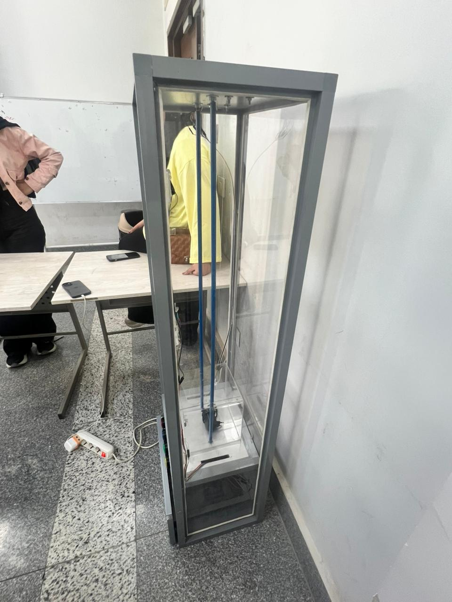
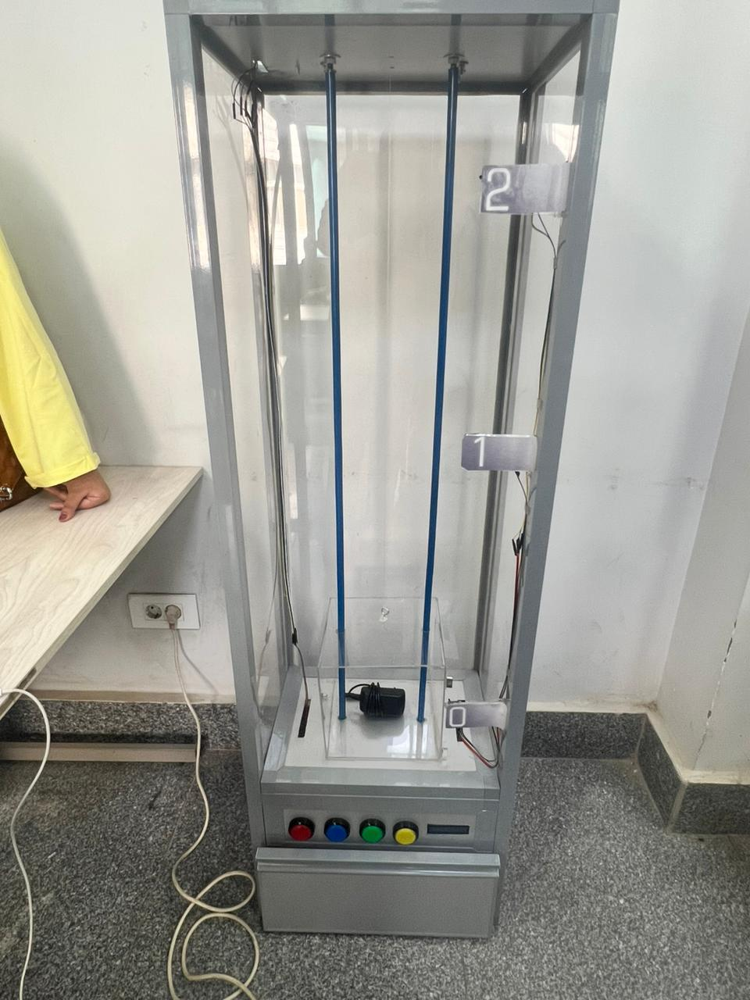
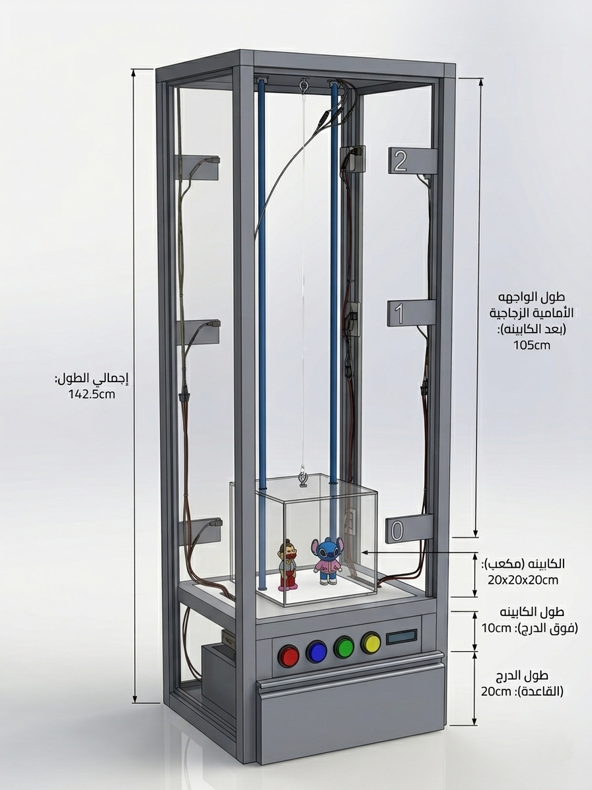
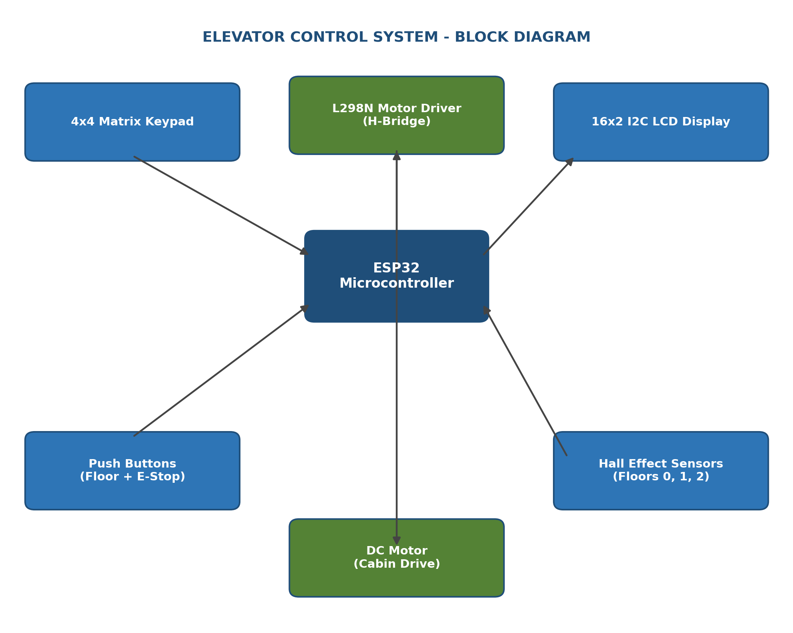
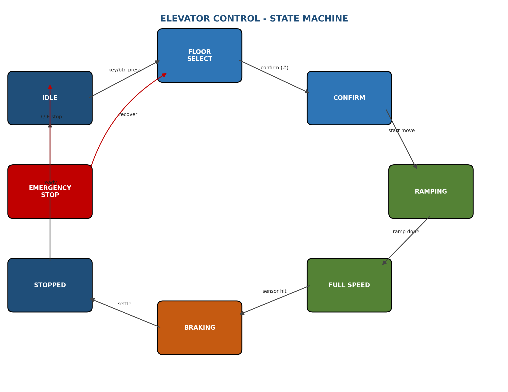
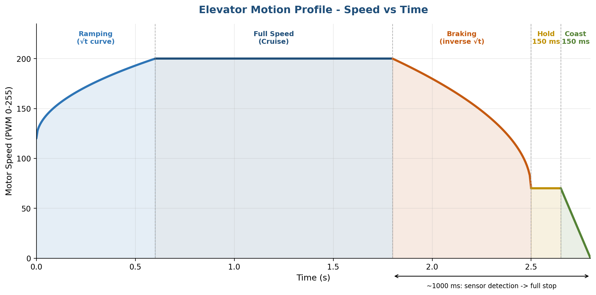

# 🛗 Elevator Braking Control System

Advanced motor control system for a 3-floor elevator model, built as a third-year **Electric Drives** project — Mechatronics Engineering, **Helwan National University**.

The core of the project is a precision multi-stage braking algorithm that produces smooth, comfortable acceleration and deceleration instead of an abrupt motor cut-off.

<p align="center">
  
  
  
</p>

---

## ✨ Features

- Smooth acceleration / deceleration with a custom 5-phase motion profile
- Dual control modes: **Keypad** (with confirmation) and **direct push-button** control
- 3-floor operation with Hall-effect floor sensing
- Emergency stop with intelligent position recovery
- Real-time status on a 16x2 I2C LCD
- Debounced sensors (80 ms) and buttons (50 ms) for reliable operation

## 🔧 Hardware

| Component | Role |
|---|---|
| ESP32 | Main microcontroller |
| L298N | H-bridge motor driver |
| 3x Hall effect sensors | Floor position detection (0, 1, 2) |
| 4x4 matrix keypad | Floor select + confirm/cancel + emergency stop |
| 16x2 I2C LCD (0x27) | Status display |
| 4x push buttons | Direct floor select + emergency stop |

<p align="center">
  
</p>

## 🧠 How it works — State Machine

The firmware is built around an 8-state finite state machine: `IDLE → FLOOR_SELECT → CONFIRM → RAMPING → FULL_SPEED → BRAKING → STOPPED`, with `EMERGENCY_STOP` reachable from any motion state.

<p align="center">
  
</p>

## 📈 Motion Profile

The signature feature of this project: a 5-phase speed curve that takes the elevator from a standstill to full speed and back to a precise, gentle stop — about **1 second** of carefully tuned deceleration between sensor detection and full stop.

<p align="center">
  
</p>

**Acceleration (RAMPING)** — square-root curve:
```
progress = t / rampTime
speed = rampMinSpeed + (maxSpeed - rampMinSpeed) * sqrt(progress)
speed = 120 + (200 - 120) * sqrt(progress)
```

**Deceleration (BRAKING)** — inverse square-root curve:
```
progress = t / brakeTime
speed = maxSpeed - (maxSpeed - brakeEndSpeed) * (1 - sqrt(1 - progress))
speed = 200 - (200 - 70) * (1 - sqrt(1 - progress))
```

**Precision stop** — Hold phase (150 ms at fixed low speed) + Coast phase (150 ms linear ramp to 0).

## 🛡️ Safety

- Emergency stop (keypad `D` or dedicated button) immediately cuts motor power and enters a recovery state
- On boot, the system checks all 3 floor sensors to auto-detect starting position (defaults to floor 0 if none are active)
- Sensor and button debouncing prevent false triggers from electrical noise

## 📂 Repository Structure

```
elevator-braking-control-system/
├── firmware/
│   └── elevator_control.ino     # ESP32 source code
├── docs/
│   └── Elevator_Braking_Control_System_Report.docx   # Full technical report
├── images/                      # Photos + diagrams
└── README.md
```

## 🚀 Getting Started

1. Open `firmware/elevator_control.ino` in the Arduino IDE (with ESP32 board support installed)
2. Install libraries: `LiquidCrystal_I2C`, `Keypad`
3. **Update the pin numbers** at the top of the file to match your wiring
4. Flash to your ESP32 and power the motor driver separately

## 📄 Full Report

See [`docs/Elevator_Braking_Control_System_Report.docx`](docs/Elevator_Braking_Control_System_Report.docx) for the complete technical write-up, including pin tables, function reference, and safety system details.

## 👥 Team

- [Name 1]
- [Name 2]
- [Name 3]

---
*Electric Drives — Mechatronics Engineering, Helwan National University*
